## Q1. Define machine learning. List the differences between classification and regression. What is the bias–variance trade-off?

**Machine Learning (ML)** means teaching computers to learn from examples and make decisions without being told every step.

**Classification vs Regression:**

* **Classification:** Output is a category (like spam or not spam).
* **Regression:** Output is a number (like predicting house price).
* **Loss functions:** Classification checks how correct the class is, regression checks how close the number is.
* **Evaluation:** Classification uses accuracy or F1 score; regression uses error like mean difference.
* **Example:** Email filter (classification), predicting temperature (regression).

**Bias–Variance trade-off:**

* **Bias:** Error when model is too simple and misses important patterns (underfitting).
* **Variance:** Error when model learns noise and fits training data too closely (overfitting).
* **Trade-off:** We need balance — not too simple, not too complex.

---

## Q2. Apply the concepts of reinforcement learning to a simple game environment. Demonstrate the use of causal inference in a healthcare prediction scenario.

### Reinforcement Learning in a Simple Game

* **Example:** A robot learns to reach a goal in a maze.
* It gets **rewards** for good moves and **penalties** for bad moves.
* It keeps trying different moves and slowly learns which actions give the most reward.
* After many tries, it learns the best way to reach the goal.

**Flowchart:**

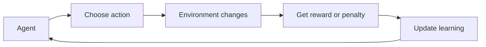

### Causal Inference in Healthcare

* Doctors want to know if a new medicine **actually causes** faster recovery, not just a random link.
* They check two groups: one takes the medicine, one does not.
* They make sure other factors like age or health are similar.
* Then they compare recovery rates to see if the medicine truly helps.

**Flowchart:**

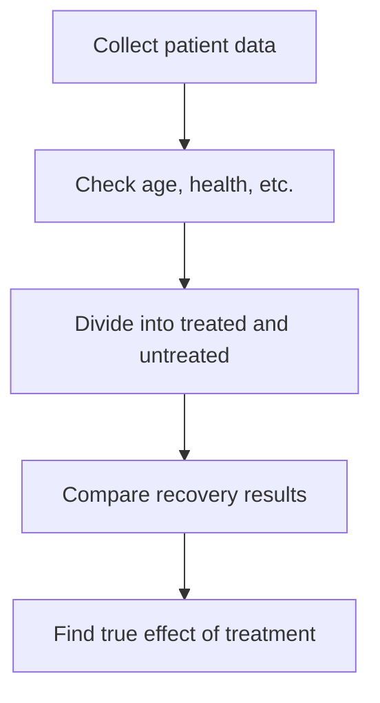

---

## Q3. Analyse the role of expectation in deriving the mean and variance of a probability distribution.

* **Expectation (mean):** It tells the average or central value of all possible outcomes.
* **Variance:** It tells how much the values differ from the average.
* **Example:** If exam scores are 60, 70, 80 — the average is 70 (expectation). Variance shows how far each score is from 70.
* **Role in ML:** Used to measure how predictions differ from true values and how much uncertainty exists in data.

---

## Q4. Evaluate the significance of information theory in feature selection for machine learning.

* Information theory helps find which features (inputs) are **most useful** for prediction.
* **Mutual Information (MI):** Checks how much knowing one feature helps to know the target.
* The higher the information gain, the better the feature.
* **Example:** For predicting weather — humidity gives more useful info than wind direction.
* Helps models become faster and more accurate by removing useless data.

---

## Q5. Apply the concept of simple models versus complex models to a given dataset. Explain which model is more suitable.

* **Simple models:** Easy to understand, quick to train, but may miss details (like straight-line models).
* **Complex models:** Can learn tricky patterns but may overfit if data is small.
* **Choose based on data:**

  * If data is small → simple model works better.
  * If data is large and rich → complex model works better.
* **Example:** Predicting house prices with 100 samples → simple linear model. With 50,000 samples and many features → deep learning.

---

## Q6. What is reinforcement learning? Define causal inference in machine learning.

**Reinforcement Learning:** The model learns by doing actions and getting feedback. It gets rewards for good actions and learns from mistakes. Example — game AI or robot navigation.

**Causal Inference:** It finds cause-and-effect relationships, not just patterns. Example — checking if exercise actually causes better health, not just that both are related.

**Flowchart:**

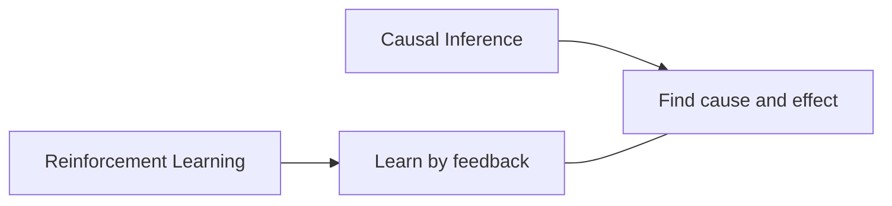

---

## Q7. Apply the concepts of reinforcement learning to a simple game environment. Describe the agent’s learning process.

* The agent starts with no knowledge of the game.
* It tries different moves and gets rewards or penalties.
* Over time, it learns which actions lead to success.
* The more it plays, the better its decisions become.
* Eventually, it finds the best strategy to win the game.

**Flowchart:**

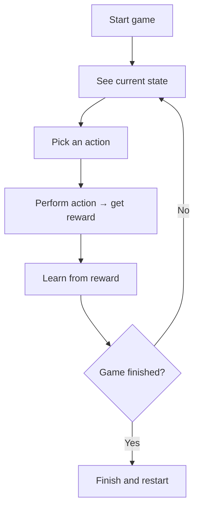
# Machine Learning — Unit 2 (6-mark answers in Simple Terms)

This README gives short, simple 6-mark answers for Questions 13–20 with flowcharts for better understanding.

---

## Q13. Design a classification model using decision trees for predicting customer churn in a telecommunications dataset. Explain your approach.

**Idea:** Customer churn means customers who stop using a service. The goal is to predict which customers might leave.

**Steps:**

1. Collect customer data — age, plan type, usage, complaints, etc.
2. Clean data and label churners (Yes/No).
3. Use a **Decision Tree Classifier** to split data based on conditions (like “calls < 30?” or “payment delays > 3?”).
4. Tree learns rules that best separate churners from non-churners.
5. Test on new data to check accuracy.
6. Use results to plan retention actions for high-risk customers.

**Flowchart:**

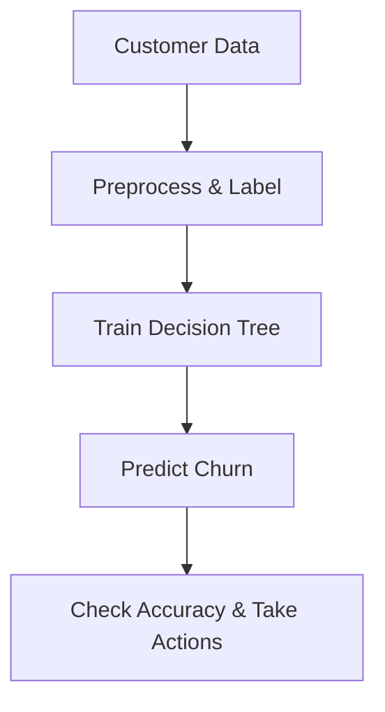

---

## Q14. Define feature extraction in machine learning. List common methods of linear dimension reduction.

**Feature Extraction:** It means converting raw data into useful features that represent important patterns for a model.

**Linear Dimension Reduction Methods:**

1. **Principal Component Analysis (PCA):** Finds new directions (components) that keep most of the data’s variation.
2. **Linear Discriminant Analysis (LDA):** Separates classes while reducing dimensions.
3. **Factor Analysis:** Identifies hidden factors that explain patterns in data.

**Example:** Turning 100 image pixels into 10 meaningful features that still represent the picture.

**Flowchart:**

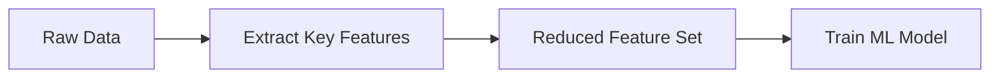

---

## Q15. Explain the concept of neural networks in nonlinear dimension reduction. Describe the significance of eigenvalues in PCA.

**Neural Networks for Nonlinear Reduction:**

* Neural networks (like **autoencoders**) can find complex patterns and reduce data dimensions that are not in straight-line relationships.
* Autoencoders compress data into a smaller “code” and then try to rebuild it.

**Eigenvalues in PCA:**

* Each eigenvalue shows how much information or variance a principal component holds.
* Larger eigenvalues = more important features.
* By keeping the biggest eigenvalues, PCA keeps the most meaningful data.

**Flowchart:**

```mermaid
flowchart LR
  A[Input Data] --> B[Encoder Network (Compress)]
  B --> C[Code (Low Dimension)]
  C --> D[Decoder (Reconstruct)]
  D --> E[Output Data]
```

---

## Q16. Compare linear and nonlinear dimension reduction techniques in feature extraction.

| Aspect       | Linear Methods                     | Nonlinear Methods                      |
| ------------ | ---------------------------------- | -------------------------------------- |
| Relationship | Assume straight-line relationships | Capture curves and complex relations   |
| Examples     | PCA, LDA                           | t-SNE, Autoencoders                    |
| Speed        | Fast and simple                    | Slower and more complex                |
| Data type    | Works on simple data               | Works on high-dimensional complex data |
| Output       | Easy to interpret                  | Harder to interpret but powerful       |

**Example:**

* **Linear:** PCA for structured numeric data.
* **Nonlinear:** Autoencoder for images or speech.

---

## Q17. Explain how decision-based methods are applied in classification. Describe the key differences between instance-based learning and decision-based methods.

**Decision-based Methods:**

* Use rules or boundaries to decide the class of data points.
* Example: **Decision Tree, Random Forest.**
* The model learns “if–else” rules to separate classes.

**Instance-based Learning:**

* Does not make rules. It compares new examples to stored ones.
* Example: **K-Nearest Neighbour (KNN).**

**Key Differences:**

| Feature       | Decision-based       | Instance-based              |
| ------------- | -------------------- | --------------------------- |
| Rule Creation | Learns general rules | No rules; compares examples |
| Memory Use    | Less                 | More                        |
| Speed         | Fast at prediction   | Slower                      |
| Example       | Decision Tree        | KNN                         |

**Flowchart:**

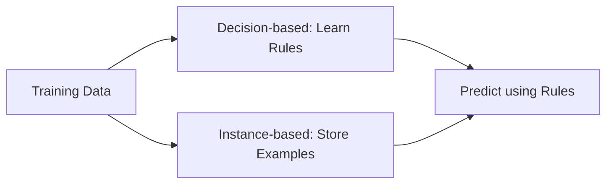

---

## Q18. Apply PCA on a dataset to reduce its dimensionality. Show the steps involved.

**PCA (Principal Component Analysis)** reduces data size while keeping important information.

**Steps:**

1. Collect and clean the dataset.
2. Standardize values (bring them to same scale).
3. Find directions with most variation (principal components).
4. Keep only top components that explain most data.
5. Use these components as new, smaller features for the model.

**Flowchart:**

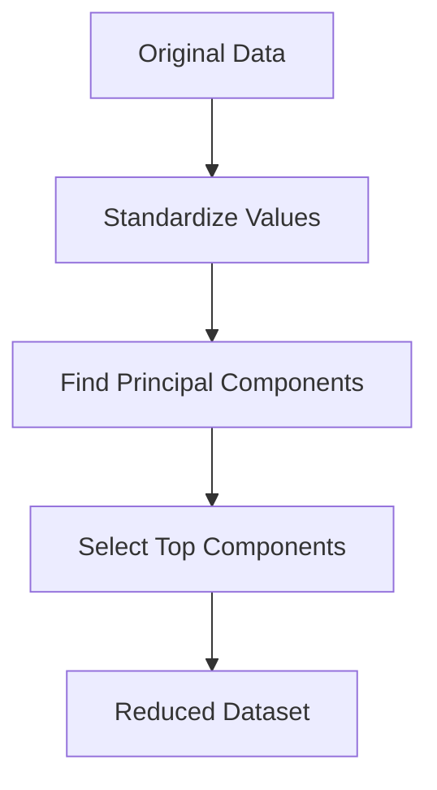

---

## Q19. Analyze the role of neural networks in extracting features from images.

* Neural networks, especially **Convolutional Neural Networks (CNNs)**, automatically detect important features like edges, colors, and shapes.
* Early layers detect simple patterns (lines), deeper layers detect complex ones (faces, objects).
* This removes the need for manual feature design.
* The network learns directly from image pixels.

**Example:** A CNN learns to identify a cat by detecting eyes, ears, and whiskers automatically.

**Flowchart:**

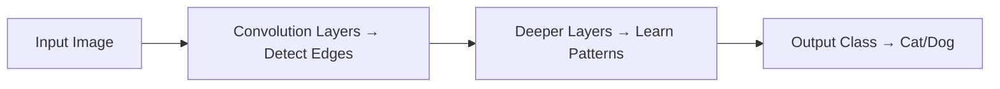

---

## Q20. Create a feature extraction method using Convolutional Neural Networks (CNN) for object recognition.

**Steps:**

1. **Input Images:** Feed raw images into CNN.
2. **Convolution Layers:** Detect local features like edges or corners.
3. **Pooling Layers:** Reduce image size but keep key details.
4. **Flatten Layer:** Convert 2D data to 1D vector.
5. **Fully Connected Layer:** Combine features for final decision.
6. **Output Layer:** Predict object class (like car, dog, or tree).

**Flowchart:**

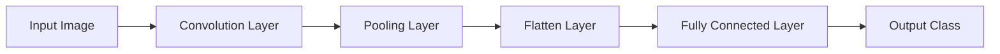


# 🧩 Machine Learning Assignment — Unit 3 Detailed Answers (Simple 6-Mark Format)

---

## 🔹 Q25. Explain how neural networks can be used as discriminative models. Describe the key differences between discriminative models and generative models.

**Answer:**
Neural networks act as **discriminative models** because they learn to **separate data into classes** based on patterns.

* **Discriminative models** focus on learning the **decision boundary** between different outputs (e.g., cat vs dog).
* **Generative models** try to **learn how the data is created** — they model the actual distribution of inputs.

**Example:**
A neural network classifies whether an email is spam or not. It only focuses on separating the two labels — not generating new emails.

**Mermaid Flowchart:**

```mermaid
flowchart LR
A[Input Data] --> B[Neural Network]
B --> C[Extract Features]
C --> D[Discriminative Decision]
D --> E[Output Class (Spam/Not Spam)]
```

---

## 🔹 Q26. Apply MLE to estimate the parameters of a Gaussian distribution.

**Answer:**
Maximum Likelihood Estimation (MLE) is used to **find the best values** for parameters that make the data most probable.

**Steps (Simple Terms):**

1. Assume the data follows a certain pattern (e.g., bell-shaped curve).
2. Try different parameter values (like mean and spread).
3. Choose the ones that best fit the observed data.

**Example:**
In a classroom, MLE can estimate the average height of students by finding the mean that best fits the recorded heights.

**Mermaid Flowchart:**

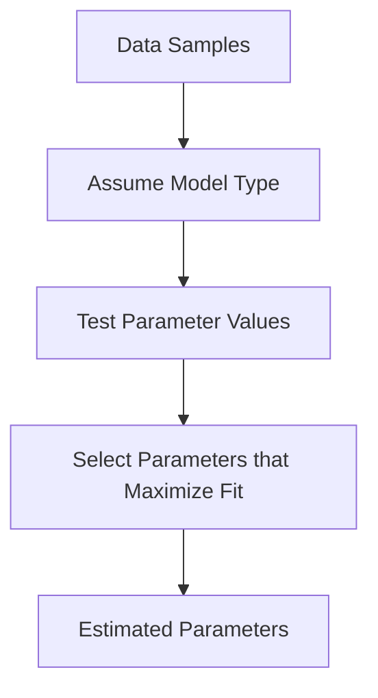

---

## 🔹 Q27. Explain how multinomial models are used in text classification. Describe the relationship between generalized linear models and linear regression.

**Answer:**
Multinomial models are used when an output can belong to **multiple categories** — such as classifying news into topics like *sports*, *tech*, or *politics*.

* **In text classification**, multinomial models use **word counts** to decide which category a text belongs to.
* **Generalized Linear Models (GLM)** extend linear regression by allowing **different types of output distributions**, not just continuous values.

**Example:**
Email classifier counting how many times words like “offer” or “free” appear to decide if it’s spam.

**Mermaid Flowchart:**

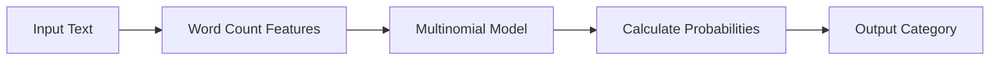

---

## 🔹 Q28. Evaluate the impact of prior selection in Bayesian learning.

**Answer:**
In Bayesian learning, a **prior** represents what we already believe before seeing new data. Choosing the right prior affects the **final prediction**.

* A **strong prior** can dominate the result when data is limited.
* A **neutral prior** lets the data speak more freely.

**Example:**
If a doctor believes 80% of flu cases have fever (prior belief), even small data without fever might not change their prediction much.

**Mermaid Flowchart:**

```mermaid
flowchart LR
A[Prior Belief] --> B[New Evidence]
B --> C[Combine via Bayes Rule]
C --> D[Updated Belief (Posterior)]
```

---

## 🔹 Q29. Compare logistic regression and support vector machines (SVM) as discriminative classifiers.

**Answer:**
Both are **classification algorithms**, but they work differently.

| Feature                 | Logistic Regression             | Support Vector Machine (SVM) |
| ----------------------- | ------------------------------- | ---------------------------- |
| Goal                    | Estimate probability of a class | Find maximum margin boundary |
| Output                  | Probabilities                   | Class labels                 |
| Handling Nonlinear Data | Needs transformation            | Can use kernels              |
| Use Case                | Simple, fast models             | Complex, flexible problems   |

**Example:**
Predicting if a student will pass (yes/no): logistic regression for simple datasets, SVM for more complex ones.

---

## 🔹 Q30. Evaluate the effectiveness of generative models in unsupervised learning tasks.

**Answer:**
Generative models are **powerful for unsupervised learning** because they learn **patterns without labeled data**.

* They can **create new samples** that look like the training data.
* Useful for **image generation, speech synthesis, and data augmentation**.

**Example:**
A model trained on animal photos can generate new animal-like images without knowing their names.

**Mermaid Flowchart:**

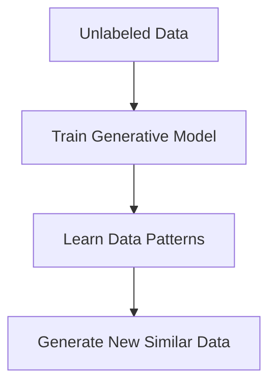

---

## 🔹 Q31. Analyse the benefits and drawbacks of generative models compared to discriminative models.

**Answer:**
**Benefits of Generative Models:**

* Can generate new data.
* Work with unlabeled data.
* Useful for anomaly detection and simulation.

**Drawbacks:**

* More complex to train.
* Sometimes less accurate for classification.

**Discriminative Models:**

* Easier and faster to train.
* Better for prediction tasks.

**Example:**
Generative models like GANs create art, while discriminative models identify if it’s a cat or a dog.

**Mermaid Flowchart:**

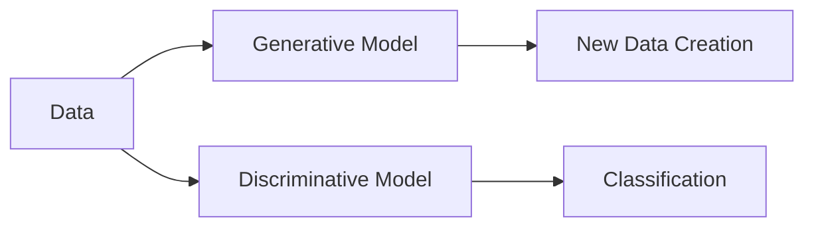

---

## 🔹 Q32. Apply Bayesian inference to update the posterior given a likelihood and a prior.

**Answer:**
Bayesian inference combines what we **believe (prior)** with **new evidence (likelihood)** to form an **updated belief (posterior)**.

**Steps:**

1. Start with prior belief.
2. Observe new data (likelihood).
3. Combine both to get the updated result.

**Example:**
A weather app predicts rain with 60% chance (prior). After seeing dark clouds (evidence), the new belief (posterior) becomes higher.

**Mermaid Flowchart:**

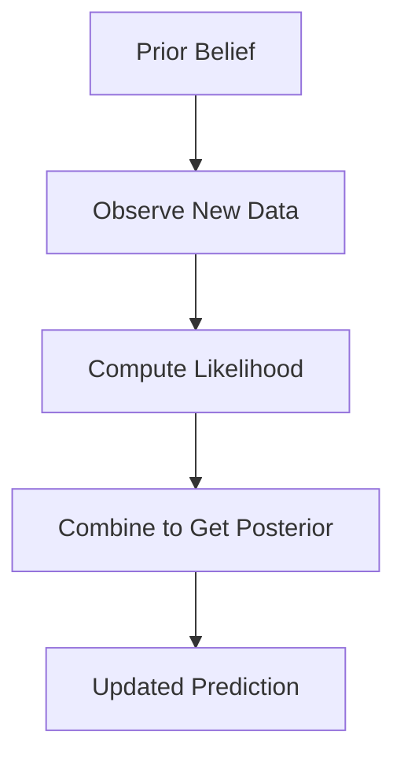

---

✨ *These answers explain key Unit 3 concepts simply — without formulas, with examples and visual clarity through flowcharts.*


---


